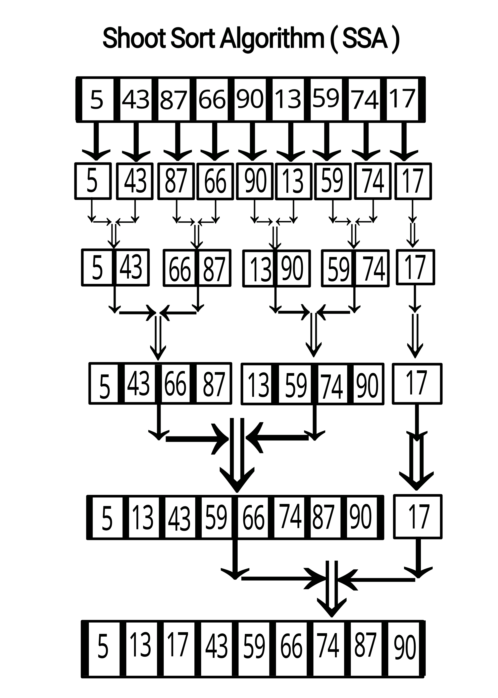

# Shoot Sort Algorithm

Shoot Sort is a custom sorting algorithm inspired by Merge Sort but with a unique approach to handling sub-array division and merging. It is designed for educational purposes to demonstrate an alternative sorting technique.

## **How Does It Work?**

Shoot Sort follows these steps to sort an array of numbers in ascending order:

1. **Initialization**: Convert each element in the array into a single-element sub-array.
2. **Merging Pairs**: Iteratively merge pairs of sub-arrays into sorted sub-arrays.
3. **Odd Sub-Array Rule**: If there’s an unmatched sub-array in the current iteration (due to odd-numbered groups), it is carried forward to the next iteration as-is.
4. **Repeat**: Continue merging until only one sorted array remains.

### **Algorithm Steps (Example)**

Input Array: `[5, 43, 87, 66, 90, 13, 59, 74, 17]`

1. **Step 1**: Convert elements into sub-arrays:  
   `[ [5], [43], [87], [66], [90], [13], [59], [74], [17] ]`
   
2. **Step 2**: Merge pairs of sub-arrays:  
   `[ [5, 43], [66, 87], [13, 90], [59, 74], [17] ]`
   
3. **Step 3**: Merge again, retaining unmatched sub-array:  
   `[ [5, 43, 66, 87], [13, 59, 74, 90], [17] ]`
   
4. **Step 4**: Continue merging until one sorted array remains:  
   `[ [5, 13, 17, 43, 59, 66, 74, 87, 90] ]`

5. **Final Output**:  
   `[5, 13, 17, 43, 59, 66, 74, 87, 90]`

---

## **Implementation**

The algorithm is implemented in **TypeScript** and consists of two primary functions:

1. **`shootSort`**: Handles the overall sorting logic by iteratively merging sub-arrays.
2. **`mergeSortedArrays`**: Merges two sorted arrays into a single sorted array.

### **Code Example**

```typescript
function shootSort(arr: number[]): number[] {
    if (arr.length <= 1) return arr;

    let arrays = arr.map((value) => [value]);

    while (arrays.length > 1) {
        const mergedArrays: number[][] = [];
        for (let i = 0; i < arrays.length; i += 2) {
            if (i + 1 < arrays.length) {
                mergedArrays.push(mergeSortedArrays(arrays[i], arrays[i + 1]));
            } else {
                mergedArrays.push(arrays[i]);
            }
        }
        arrays = mergedArrays;
    }

    return arrays[0];
}

function mergeSortedArrays(left: number[], right: number[]): number[] {
    const merged: number[] = [];
    let i = 0, j = 0;

    while (i < left.length && j < right.length) {
        if (left[i] <= right[j]) {
            merged.push(left[i]);
            i++;
        } else {
            merged.push(right[j]);
            j++;
        }
    }

    return merged.concat(left.slice(i), right.slice(j));
}
```
---
## **Features**

- **Base Case**: Efficient handling of arrays with one or fewer elements.
- **Custom Rule**: Odd sub-arrays are preserved as-is for the next merge iteration.
- **Reusable Components**: The merging logic is abstracted for modularity.

---
## **Performance**
The time complexity of Shoot Sort is similar to Merge Sort:

- **Best Case**: O(n log n)
- **Worst Case**: O(n log n)
- **Space Complexity**: O(n) (due to sub-array allocations during merging)

---
## **Usage**
To use Shoot Sort in your project (typescript)

- 1. Copy the provided TypeScript code into your project.
- 2. Call the shootSort function with an array of numbers:
 ``` typescript
const unsortedArray = [5, 43, 87, 66, 90, 13, 59, 74, 17];
const sortedArray = shootSort(unsortedArray);
console.log(sortedArray);
```

---

## **Example output**

For the input array ``` [5, 43, 87, 66, 90, 13, 59, 74, 17] ```, the output is:
```[5, 13, 17, 43, 59, 66, 74, 87, 90]```

---
## **Contributing**
Contributions to improve the Shoot Sort algorithm are welcome! Feel free to open a pull request or submit issues for discussion.

---
## **License**
This project is open-sourced under the MIT License. See the LICENSE file for more details.

---
## **Author** 
- **Sr / Ajmal Alkhaledi**